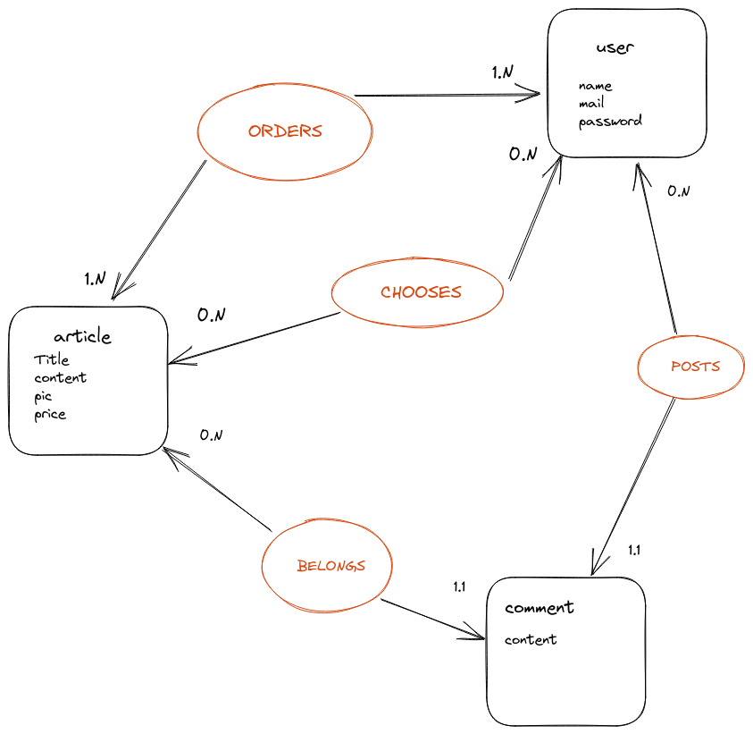

# User Story :

   ## Rappel MVP :  

 Inscription / Connection / Filtrage des articles de A à Z  / Achat / Panier / Commentaires

| En tant que |          Je souhaite              |                Afin de                       |
|-------------|-----------------------------------|----------------------------------------------|
| visiteur    | Créer un compte                   | M'inscrire                                   |
| visiteur    | Voir les articles                 | Savoir si un canard me plais                 |
| visiteur    | Filtrer les articles              | Chercher un articles                         |
| Visiteur    | Lire les commentaires             | Consulter les avis                           |
| Admin       | modifier un article               | gerer les articles                           |
| Admin       | suprimer un article               | gerer les articles                           |
| Admin       | créer un article                  | gerer les articles                           |
| Utilisateur | Se connecter                      | Utiliser le site                             |
| Utilisateur | Accéder au panier                 | Mettre à jour le panier                      |
| Utilisateur | Commenter un article              | Donner un avis sur le produit                |
| Utilisateur | Modifier le panier                | Gérer mes achats                             |
| Utilisateur | Ouvrir la page d'un article       | Voir les détails de l'article                |         


# Arborescence : 

```
|
|-----/home
|
|-----/articles
|         |
|         |------------/article:id
|                           |---------Commentaire 
|           
|
|--------------/signup
|
|
|--------------/login
                  |
                  |
                  |--------/basket
                                 
                                                      

```


# Liste des routes / CRUD (Create / Read / Update / Delete): 


|URL                              | HTTP   | Description               | Données attendues        | Autorisation             |
|---------------------------------|--------|---------------------------|--------------------------|--------------------------|
|/admin                           | GET    | Recupèrer un article      | Article  id              | GET one article          |
|                                 | POST   | Créer un article          | Article  id              | POST one article         |
|                                 | PATCH  | Modifier un article       | Article  id              | PATCH one article        |
|                                 | DELETE | Supprimer un article      | Article  id              | DELETE one article       |
|/user                            | POST   | Créer l'utilisateur       | Email/password/name      | POST user                |
|/login                           | POST   | Connecter l'user          | Email/password/name      | POST user / verify       | 
|/user/:id                        | GET    | Recupérer un utilisateur  | name/password            | GET user                 | 
|                                 | PATCH  | Modifier un utilisateur   | name/password            | PATCH name/password      | 
|                                 | DELETE | Supprimer l'utilisateur   | name/password            | DELETE account           |
|/articles                        | GET    | Récupèrer les articles    | Tous les articles        | GET all articles         |
|/articles                        | GET    | Trier de A à Z            | Tous les articles        | ORDER by                 |
|/articles/:articlesid            | GET    | Récupèrer 1 article       | Un article id            | GET one article          |
|/articles/:articleid/comment     | GET    | Récupèrer les commentaires| Des commentaires         | GET all com from article |
|                                 | POST   | Mettre des commentaires   | Commentaire id           | POST one comment         |
|                                 | PATCH  | Modifier son commentaire  | Commentaire id           | PATCH one comment        |
|                                 | DELETE | Supprimer son commentaire | Commentaire id           | DELETE one comment       |
|/user/cart                       | GET    | Récupérer les articles    | Articles                 | GET all articles         |
|                                 | PATCH  | Modifier le nb d'articles | Nombres                  | PATCH nb article         |
|                                 | DELETE | Supprimer un article      | Article id               | DELETE article           |

# MCD
FAIT , voir PNG dans le repo

<p align="center">
  
</p>


# MLD


Entité user: 
   - Unique identifier, name, password, mail


Entité article: 
   - Unique identifier, title, content, pic, price


Entité comment: 
   - Unique identifier, content
   - #article_identifier
   - #user_identifier

Tables de liaison :

user_cart:
   - #article_identifier
   - #user_identifier

user_order:
   - #article_identifier
   - #user_identifier

